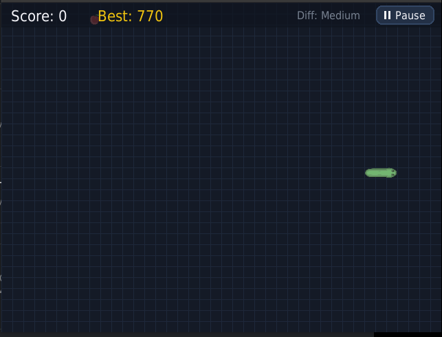

# Snake Arcade Game with Sprites



A modular recreation of the classic Snake arcade game built with Python and Pygame-ce. The project features sprite-based rendering, smooth input queuing, persistent high score tracking, customizable settings, particle effects, and an autonomous AI pathfinding mode.

---

## Features

- **Smooth 60 FPS Game Loop**: Built with a dedicated game engine managing physics updates, rendering interpolation, and state transitions.
- **Sprite-Based Visuals**: Orientation-aware rendering for snake head, body, turn corners, and tail segments.
- **Responsive Dual Input**: Supports both WASD and Arrow Keys with an internal directional queue to eliminate dropped inputs during rapid successive turns.
- **Hold-to-Speed-Up (Turbo Boost)**: Hold Shift, Space, or Tab to accelerate snake movement in both manual play and AI auto-play mode.
- **Food Varieties & Mechanics**:
  - **Standard Apple**: Awards 10 points and increases snake length by 1 segment.
  - **Golden Apple**: Rare timed bonus item awarding 50 points and 2 length segments, featuring an active visual countdown ring.
- **Persistent High Scores**: Automatically records and saves local high score records across all difficulty levels to disk.
- **Autonomous AI Auto-Play**: Pathfinding solver utilizing Breadth-First Search (BFS) combined with flood-fill space-safety checks and tail-chasing stall heuristics to prevent self-trapping.
- **Interactive UI & Settings**:
  - Main Menu, Settings Screen, Pause Menu, and Game Over Screen with mouse hover states and keyboard navigation.
  - Configurable settings: Difficulty (Easy, Medium, Hard, Insane), Sound Effects (On/Off), Auto-Play (On/Off), and Wall Wrap Mode (On/Off).
- **Visual Feedback**: Screen shake upon collision and dynamic particle bursts for apple consumption and game over explosions.

---

## Controls

| Key | Action |
|:---|:---|
| `W` or `Up Arrow` | Move Up |
| `A` or `Left Arrow` | Move Left |
| `S` or `Down Arrow` | Move Down |
| `D` or `Right Arrow` | Move Right |
| **Hold `Shift` / `Space` / `Tab`** | **Turbo Speed Boost** (Player and AI) |
| `Esc` / `P` / Click HUD | Pause or Resume Game |
| `R` | Quick Restart (Game Over Screen) |
| `M` | Return to Main Menu (Game Over Screen) |

---

## Getting Started

### Prerequisites
- Python 3.10 or higher (including Python 3.14+)
- Virtual environment support

### Installation

1. Clone the repository:
   ```bash
   git clone https://github.com/P20000/snake-sprite-game.git
   cd snake-sprite-game
   ```

2. Create and activate a virtual environment:
   ```bash
   python3 -m venv venv
   source venv/bin/activate
   ```

3. Install required dependencies:
   ```bash
   pip install -r requirements.txt
   ```

4. Launch the game:
   ```bash
   python3 app.py
   ```

---

## Running Automated Tests

The codebase includes unit test coverage across all subsystems:

```bash
python3 -m unittest discover -s tests -v
```

Test coverage includes:
- **test_snake.py**: Movement mechanics, input buffer queue, self-collision, wall collision, and edge-wrap logic.
- **test_food.py**: Grid positioning validation, golden apple lifetime counters, and expiration routines.
- **test_high_score.py**: Score persistence, record updating, and JSON serialization.
- **test_ai_solver.py**: BFS shortest path calculation, suicide turn prevention, and safe speed boost detection.
- **test_particle.py**: Particle physics, lifecycle decay, and burst emitter generation.
- **test_game_engine.py**: State machine transitions, speed boost states, pause overlays, and headless execution.

---

## Architecture and Code Organization

The application is structured into modular components, keeping each module under a strict 500-line budget:

```
snake-game/
├── app.py                  # Main application entry point
├── requirements.txt        # Python dependency definitions
├── highscores.json         # Local persistent high score storage
├── src/
│   ├── __init__.py         # Package marker
│   ├── constants.py        # Screen dimensions, color palettes, and game states
│   ├── assets.py           # Texture loading, sound effects, and font fallbacks
│   ├── snake.py            # Snake entity, direction queuing, and rendering
│   ├── food.py             # Food entities, score values, and spawn algorithms
│   ├── particle.py         # Particle emitters for bite sparks and collision bursts
│   ├── high_score.py       # High score file manager
│   ├── ai_solver.py        # Pathfinding solver and flood-fill space evaluator
│   ├── menu.py             # UI buttons, HUD rendering, and modal screens
│   └── game_engine.py      # Main game loop, input routing, and state coordinator
└── tests/
    ├── __init__.py         # Test package setup
    ├── test_snake.py       # Snake entity unit tests
    ├── test_food.py        # Food item unit tests
    ├── test_high_score.py  # High score manager unit tests
    ├── test_ai_solver.py   # AI solver unit tests
    ├── test_particle.py    # Particle system unit tests
    └── test_game_engine.py # Game engine unit tests
```

---

## License

This project is open-source software licensed under the MIT License.
